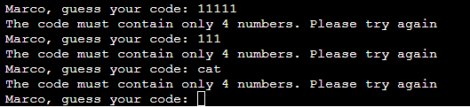

# Mastermind-Wargames

The Mastermind Wargames game is a variant of the well known Mastermind game. 

The gameplay is centered on discovering a 4 digits code. BOth CPU and player play at the same time, but against different unique secret codes.

The style of the game, the typewriting effect and the messages are inspired by the 1983 movie "Wargames".

Visit the deployed application [here](https://mastermind-wargames-0d7588febbfa.herokuapp.com/).

## Table of Contents
1. [User Experience (UX)](#user-experience-UX)
    1. [Project Goals](#project-goals)
    2. [User Stories](#user-stories)
    3. [Color Scheme and Fonts](#color-scheme-and-fonts)
    4. [Data Model](#data-model)
    5. [Flowchart](#flowchart)
2. [Features](#features)
    1. [User Information Input](#user-information-input)
    2. [Greetings and rules](#greetings-and-rules)
    3. [Gameplay syncro with CPU](#Gameplay-syncro-with-CPU)
    4. [Player guess is validated](#Player-guess-is-validated)
    5. [Player and CPU receive feedback at the same time](#Player-and-CPU-receive-feedback-at-the-same-time)
    6. [Further rounds are evaluated and history shown](#Further-rounds-are-evaluated-and-history-shown)
    7. [CPU intelligence](#CPU-intelligence)
    8. [Game progress](#Game-progress)
    9. [Win-Lose Message](#Win-Lose-Message)
    10. [Restart Program](#restart-program)
3. [Technologies Used](#technologies-used)
    1. [Language Used](#language-used)
    2. [Frameworks, Libraries and Programs Used](#frameworks-libraries-and-programs-used)
4. [Testing](#testing)
    1. [Testing User Stories](#testing-user-stories)
    2. [Code Validation](#code-validation)
    3. [Manual Testing](#manual-testing)
5. [Deployment](#deployment)
6. [Credits](#credits)
7. [Acknowledgements](#acknowledgements)

***

## User Experience (UX)

### Project Goals

* Interactive gameplay, engaging for the user.

* Instructions are clearly visible at the beginning of the game to allow easy undesranding and easy playing

* Each step of the game provides feedback on the actual and previous turns, guiding the player to an easier solution

* The CPU acts using a certain degree of intelligence, making the game more engaging

* Provides input validation to help the user input the correct data.

* The program should keep running until the user decides otherwise.

### User Stories

* As a user, I want to receive information about the main objective of the program.

* As a user, I want to easily understand what input is needed on each step.

* As a user, I want to receive clear feedback in case I provide the wrong input.

* As a user, I want to be able to review the data I provided .

* As a user, I want to be informed about the progress of the game.

### Color Scheme and Fonts

No color scheme has been applied to the terminal text, to maintain the inspiration from the movie.
[pyfiglet](https://pypi.org/project/pyfiglet/) has been used to easily apply an engaging font for the win/lose messages

### Data Model

Different data are stored as global variablesas they need to be accesses in different areas of the game.

Complex data (like the feedback to the user guess, or the secret code) are stored as lists to allow iteration on the different elements.

Methods to convert strigs to lists (and vice-versa) are used to prepare the output (print to terminal) for the user or to read the information already printed and run iterations.

### Flowchart

The following flowchart was designed using [LucidChart](https://www.lucidchart.com/pages/?) in order to plan the logic to be implemented in the program.

[Back to top ⇧](#mastermind-wargames)

## Features

### User Information Input

Collect the users information (name) in order to use it in the program.

### Greetings and rules

Show greeting message and rules of the game.

### Gameplay syncro with CPU

Both CPU and Player play at the same time.

### Player guess is validated

Player input is validated to be 4 digits (no more, no less, no other characters than numbers).

### Player and CPU receive feedback at the same time

Player input and CPU guess are checked against the respective codes and feedback is presented at the same time

### Further rounds are evaluated and history shown

Further Player input and CPU guess are checked against the respective codes and feedback is presented at the same time, history is shown for reference

### CPU intelligence

CPU is intelligent enough to not rtepeat already found digits in the code

### Game progress

Different messages are shown when the game is progressing (3 digits found). Messages are different for CPU and Player

### Win-Lose Message

Different messages are shown when the player or the CPU win the game (4 digits found). The message are transitory and quite fast (inspiration from the movie) and end up in a common message

### Restart Program
Allow the user to keep running or exit the program.

[Back to top ⇧](#mastermind-wargames)

## Technologies Used

### Language Used

* [Python3](https://en.wikipedia.org/wiki/Python_(programming_language))

### Frameworks, Libraries and Programs Used

* [GitPod](https://gitpod.io/) was used for writing code, committing, and then pushing to GitHub.

* [GitHub](https://github.com/) was used to store the project after pushing.

* [Heroku](https://id.heroku.com/) was used to deploy the application.

* [PEP8 online check](http://pep8online.com/) was used to validate the Python code.

* [pyfiglet](https://pypi.org/project/pyfiglet/) library was used to print the win-lose messages in a styled font

* [LucidChart](https://www.lucidchart.com/pages/?) was used to create the program flowchart.

[Back to top ⇧](#mastermind-wargames)

## Testing

### Testing User Stories
* As a user, I want to receive information about the main objective of the program.

    - Information about the objective of the game is presented in the welcome message, just after the login (inspiration from the movie)

* As a user, I want to easily understand what input is needed on each step.

    - The type of input is clearly stated in the rules of the game and the name of the player is recalld when an input is requested

* As a user, I want to receive clear feedback in case I provide the wrong input.

    - The guess input is validated (4 digits, only numbers) and feedback is provided, together with the required type of input, when the input is wrong.

    - The y/n question to restart the game is validated and a relevant message is shown if another letter is inputed

* As a user, I want to be able to review the data I provided .

    - The table shows all the guesses provided both by CPU and Player during the game

* As a user, I want to be informed about the progress of the game.

    - The feedback about the cpu and player guess provides game progress (number of digits found). when 3 digits are found a special message is shown

    - In case of victory a special sequence of messages is shown.

    - In case of tie result (end of turns) a request for a new game is shown.

### Code Validation

The [PEP8 online check](http://pep8online.com/) was used continuosly during the development proces to validate the Python code for PEP8 requirements.

### Manual Testing

<table>
    <tr>
        <th>Feature</th>
        <th>Outcome</th>
        <th>Example</th>
        <th>Pass/Fail</th>
    </tr>
    <tr>
        <td>Name Input</td>
        <td>Validate if value is empty</td>
        <td></td>
        <td>Pass</td>
    </tr>
    <tr>
        <td rowspan=4>Age Input</td>
        <td>Validate if value is empty</td>
        <td></td>
        <td>Pass</td>
    </tr>
        <td>Validate if value is too low</td>
        <td></td>
        <td>Pass</td>
    </tr>
    <tr>
        <td>Validate if value is too high</td>
        <td></td>
        <td>Pass</td>
    </tr>
    <tr>
        <td>Validate if value is not an integer</td>
        <td></td>
        <td>Pass</td>
    </tr>
    <tr>
        <td rowspan=2>Sex Selection</td>
        <td>Validate if value is empty</td>
        <td></td>
        <td>Pass</td>
    </tr>
    <tr>
        <td>Validate if invalid value</td>
        <td></td>
        <td>Pass</td>
    </tr>
        <tr>
        <td rowspan=2>Unit Selection</td>
        <td>Validate if value is empty</td>
        <td></td>
        <td>Pass</td>
    </tr>
    <tr>
        <td>Validate if invalid value</td>
        <td></td>
        <td>Pass</td>
    </tr>
    <tr>
        <td rowspan=8>Weight Input</td>
        <td rowspan=2>Validate if value is empty</td>
        <td></td>
        <td rowspan=2>Pass</td>
    </tr>
    <tr>
        <td></td>
    </tr>
    </tr>
        <td rowspan=2>Validate if value is too low</td>
        <td></td>
        <td rowspan=2>Pass</td>
    </tr>
    <tr>
        <td></td>
    </tr>
    </tr>
        <td rowspan=2>Validate if value is too high</td>
        <td></td>
        <td rowspan=2>Pass</td>
    </tr>
    <tr>
        <td></td>
    </tr>
    <tr>
        <td rowspan=2>Validate if value is not an integer</td>
        <td></td>
        <td rowspan=2>Pass</td>
    </tr>
    <tr>
        <td></td>
    </tr>
    <tr>
        <td rowspan=8>Height Input</td>
        <td rowspan=2>Validate if value is empty</td>
        <td></td>
        <td rowspan=2>Pass</td>
    </tr>
    <tr>
        <td></td>
    </tr>
    </tr>
        <td rowspan=2>Validate if value is too low</td>
        <td></td>
        <td rowspan=2>Pass</td>
    </tr>
    <tr>
        <td></td>
    </tr>
    </tr>
        <td rowspan=2>Validate if value is too high</td>
        <td></td>
        <td rowspan=2>Pass</td>
    </tr>
    <tr>
        <td></td>
    </tr>
    <tr>
        <td rowspan=2>Validate if value is not an integer</td>
        <td></td>
        <td rowspan=2>Pass</td>
    </tr>
    <tr>
        <td></td>
    </tr>
    <tr>
        <td rowspan=2>Activity Level Selection</td>
        <td>Validate if value is empty</td>
        <td></td>
        <td>Pass</td>
    </tr>
    <tr>
        <td>Validate if invalid value</td>
        <td></td>
        <td>Pass</td>
    </tr>
    <tr>
        <td rowspan=2>Goal Selection</td>
        <td>Validate if value is empty</td>
        <td></td>
        <td>Pass</td>
    </tr>
    <tr>
        <td>Validate if invalid value</td>
        <td></td>
        <td>Pass</td>
    </tr>
    <tr>
        <td rowspan=4>Rate Selection</td>
        <td rowspan=2>Validate if value is empty</td>
        <td></td>
        <td rowspan=2>Pass</td>
    </tr>
        <td></td>
    </tr>
    <tr>
        <td rowspan=2>Validate if invalid value</td>
        <td></td>
        <td rowspan=2>Pass</td>
    </tr>
    </tr>
        <td></td>
    <tr>
    <tr>
        <td rowspan=2>Diet Selection</td>
        <td>Validate if value is empty</td>
        <td></td>
        <td>Pass</td>
    </tr>
    <tr>
        <td>Validate if invalid value</td>
        <td></td>
        <td>Pass</td>
    </tr>
    <tr>
        <td>Review Data</td>
        <td>Allow user to enter the data again</td>
        <td></td>
        <td>Pass</td>
    </tr>
    <tr>
        <td rowspan=2>Restart Program</td>
        <td rowspan=2>Keep running or exit the program</td>
        <td></td>
        <td rowspan=2>Pass</td>
    </tr>
    <tr>
        <td></td></tr>
</table>

[Back to top ⇧](#mastermind-wargames)

## Deployment

The application has been deployed using [Heroku](https://id.heroku.com/) by following these steps:

[Heroku](https://id.heroku.com/) was used to deploy the application.

1. Create the requirements.txt file and run: `pip3 freeze > requirements.txt` in the console.
2. Commit changes and push them to GitHub.
3. Go to the Heroku's website.
4. From the Heroku dashboard, click on "Create new app".
5. Enter the "App name" and "Choose a region" before clicking on "Create app".
6. Go to "Config Vars" under the "Settings" tab.
7. Click on "Reveals Config Vars" and add the KEY: CREDS and the VALUE stored in creds.json file if needed.
8. Add the Config Var, KEY: PORT and VALUE: 8000.
9. Go to "Buildpacks" section and click "Add buildpack".
10. Select "python" and click "Save changes"
11. Add "nodejs" buildpack as well using the same process.
12. Go to "Deployment method", under the "Deploy" tab select "GitHub" and click on "Connect to GitHub".
13. Go to "Connect to GitHub" section and "Search" the repository to be deployed.
14. Click "Connect" next the repository name.
15. Choose "Automatic deploys" or "Manual deploys" to deploy your application.

[Back to top ⇧](#mastermind-wargames)

## Credits

### Content

* Inspiration for the calculator and the explanations were taken from [Legion Athletics](https://legionathletics.com/) as well as the Mifflin-St Jeor formula to calculate the [BMR](https://legionathletics.com/what-is-bmr/).

* The activity multipliers to calculate the TDEE was taken from the [Physical Activity and Controlling Weight ](https://www.k-state.edu/paccats/Contents/PA/PDF/Physical%20Activity%20and%20Controlling%20Weight.pdf) document found at the [Kansas State University](https://www.k-state.edu/) website.

### Media
* The ASCII art is a modified version of an original art created with [ASCII-Generator](https://ascii-generator.site/).

### Code
* [Stack Overflow](https://stackoverflow.com/) was consulted on a regular basis for inspiration and sometimes to be able to better understand the code being implement.

[Back to top ⇧](#macro-calculator)

## Acknowledgements

* My partner, for her unconditional love, help and continued support in all aspects of life to make possible for me to complete this project.

* My tutor, Marcel, for his invaluable feedback and guidance.

* Code Institute and its amazing Slack community for their support and providing me with the necessary knowledge to complete this project.
